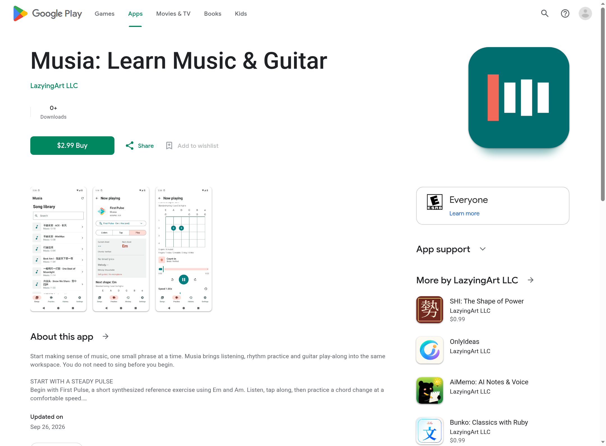
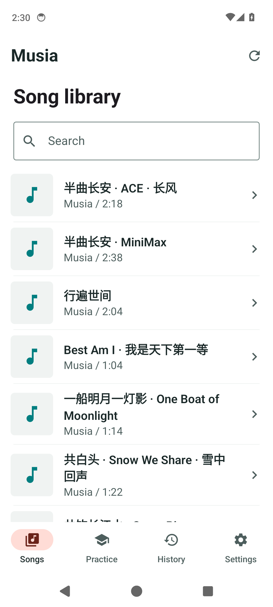
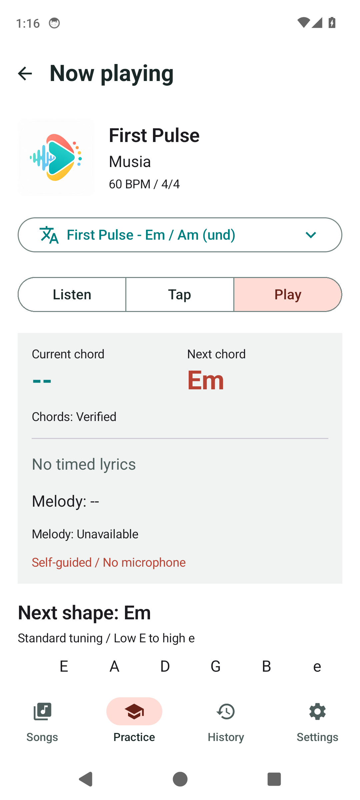
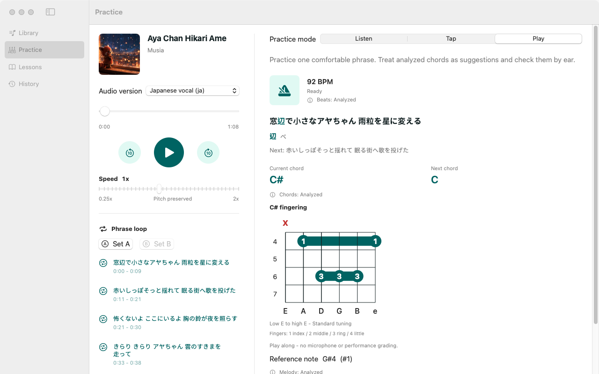

[English](../README.md) · [العربية](README.ar.md) · [Español](README.es.md) · [Français](README.fr.md) · [日本語](README.ja.md) · [한국어](README.ko.md) · [Tiếng Việt](README.vi.md) · [中文 (简体)](README.zh-Hans.md) · [中文（繁體）](README.zh-Hant.md) · [Deutsch](README.de.md) · [Русский](README.ru.md)

[](https://github.com/lachlanchen/lachlanchen/blob/main/figs/banner.png)

# Musia

*Localización musical con IA: extrae voz humana, pistas, letras, beats y acordes de una canción, y prepara el camino hacia re-canto multilingüe cantable.*

[](https://lazying.art)
[](../environment.yml)
[](../references/local-setup-and-test-report.md)
[](https://github.com/sponsors/lachlanchen)

Musia es un prototipo de investigación local-first para localización musical con IA. El MVP actual toma una canción, la separa en las cuatro pistas de Demucs `bass`, `drums`, `vocals` y `other`, crea una mezcla `instrumental`, guarda la voz como `human_sound`, transcribe letras, estima beats y produce segmentos de acordes al estilo Chordify.

## La App Musia

[](https://play.google.com/store/apps/details?id=art.lazying.musia) · [Abrir la app web](https://musia.lazying.art)

Android 0.1.1 está disponible por **US$2.99**. Aprende con escucha, práctica rítmica, diagramas de acordes de guitarra, velocidad ajustable sin cambiar el tono y repetición de frases. No necesitas cuenta ni suscripción.

[](https://play.google.com/store/apps/details?id=art.lazying.musia)

*Página pública de Google Play, capturada el 5 de octubre de 2026. El precio puede variar según la región.*

### Dentro de la App Android

| Biblioteca de canciones | Práctica guiada |
| :---: | :---: |
|  |  |

Capturas reales de la app Android publicada, no maquetas.

<details>
<summary>Vista previa nativa de macOS (en revisión)</summary>

Las apps nativas de iOS y macOS están enviadas a revisión y aún no están disponibles públicamente a fecha del 5 de octubre de 2026.



</details>

| Donate | PayPal | Stripe |
| --- | --- | --- |
| [](https://chat.lazying.art/donate) | [](https://paypal.me/RongzhouChen) | [](https://buy.stripe.com/aFadR8gIaflgfQV6T4fw400) |

## Qué Produce

```text
input song
-> source/input.wav
-> stems/bass.wav
-> stems/drums.wav
-> stems/vocals.wav
-> stems/other.wav
-> stems/instrumental.wav
-> stems/human_sound.wav
-> analysis/lyrics.json + lyrics.txt
-> analysis/beats.json + beats.csv
-> analysis/chords.json + chords.csv
-> manifest.json + REPORT.md
```

`instrumental.wav` se mezcla desde `bass + drums + other`. `human_sound.wav` es la pista vocal aislada `vocals.wav`.

## Contenido Actual

| Path | Purpose |
| --- | --- |
| [`musia/`](../musia/) | Kit local de análisis en Python. |
| [`scripts/bootstrap_musia.sh`](../scripts/bootstrap_musia.sh) | Crea el entorno conda e instala la pila local. |
| [`scripts/download_open_songs.py`](../scripts/download_open_songs.py) | Descarga canciones de prueba libres/abiertas. |
| [`scripts/run_pipeline.py`](../scripts/run_pipeline.py) | Ejecuta separación, transcripción, beats, acordes y reporte. |
| [`scripts/install_research_repos.sh`](../scripts/install_research_repos.sh) | Clona repositorios de investigación opcionales en `third_party/`. |
| [`scripts/musia_lyricfit_openai.py`](../scripts/musia_lyricfit_openai.py) | Ayudante opcional de adaptación lírica con OpenAI. |
| [`references/`](../references/) | Arquitectura, investigación profunda y notas de instalación local. |
| [`TODO.md`](../TODO.md) | Lista de construcción y próximos pasos. |

## Inicio Rápido

```bash
bash scripts/bootstrap_musia.sh
PYTHONNOUSERSITE=1 conda run -n musia python scripts/download_open_songs.py --id danny-boy-1917
PYTHONNOUSERSITE=1 conda run -n musia python scripts/run_pipeline.py data/open_songs/danny-boy-1917/original.ogg --run-name smoke-danny --max-duration 45 --asr-model tiny
```

Los resultados se escriben en:

```text
data/runs/<run-name>/
```

El audio generado, las canciones descargadas, los pesos de modelos y los clones de terceros quedan ignorados por git.

## Validación Local

La prueba local con una grabación abierta de Wikimedia Commons pasó en una máquina con NVIDIA RTX 4090 D:

```bash
PYTHONNOUSERSITE=1 conda run -n musia python scripts/run_pipeline.py data/open_songs/danny-boy-1917/original.ogg --run-name smoke-danny-120-fixed --max-duration 120 --asr-model base.en --language en --demucs-device cuda
```

Resultado registrado:

- Cuatro pistas: `bass`, `drums`, `vocals`, `other`
- Audio adicional: `instrumental`, `human_sound`
- Tempo estimado: `129.20 BPM`
- Beats: `257`
- Segmentos de acordes: `132`
- Estado de letras: `ok`

Ver [`references/local-setup-and-test-report.md`](../references/local-setup-and-test-report.md).

## Dirección Arquitectónica

Musia no es solo traducción más TTS. El flujo completo previsto es:

```text
song upload
-> rights / ownership check
-> vocal + instrumental separation
-> lyrics transcription
-> word / phoneme timing
-> melody / pitch extraction
-> singable lyric adaptation
-> AI singing synthesis
-> optional voice/timbre conversion
-> mixing + mastering
-> music-player interface
```

Este repositorio implementa la primera capa de análisis local. La síntesis cantada con YingMusic-Singer-Plus, SoulX-Singer y modelos relacionados queda como integración de investigación porque requiere pesos grandes, revisión de licencias y workers GPU separados.

## Cita

Si usas Musia en investigación, cita el repositorio. GitHub lee [`CITATION.cff`](../CITATION.cff) y muestra **Cite this repository** en la página del repo.

```bibtex
@software{chen_musia_2026,
  author = {Chen, Lachlan},
  title = {Musia: Local-first AI song localization and music analysis},
  year = {2026},
  url = {https://github.com/lachlanchen/Musia}
}
```

## Estado

Musia es software de investigación temprano. La canalización local sirve para pruebas y artefactos, pero el detector de acordes es una línea base ligera y la capa de re-canto cantable todavía no está lista para producción. Usa canciones propias, de dominio público, licenciadas o subidas por sus creadores.
